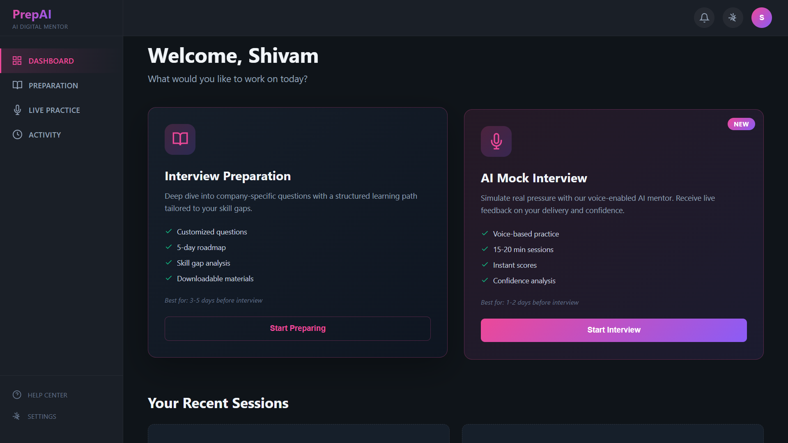
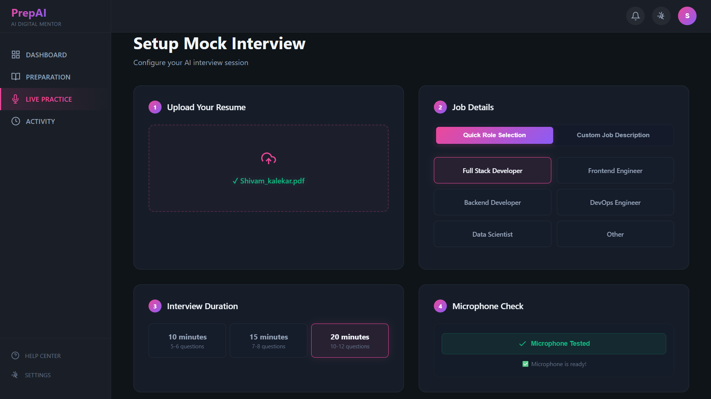
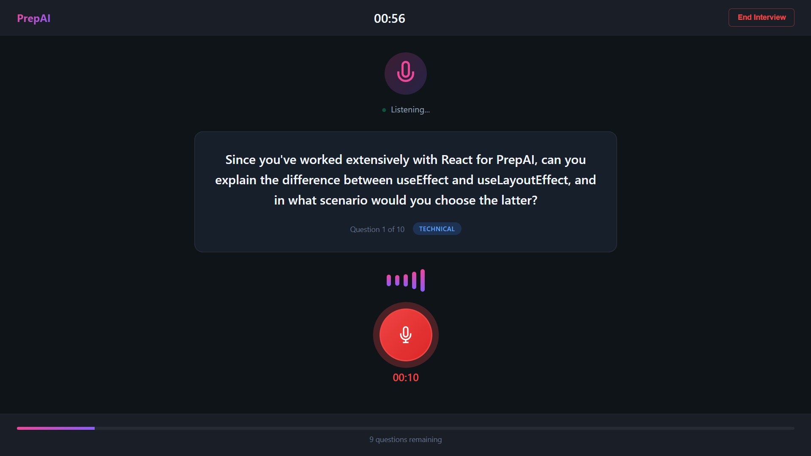
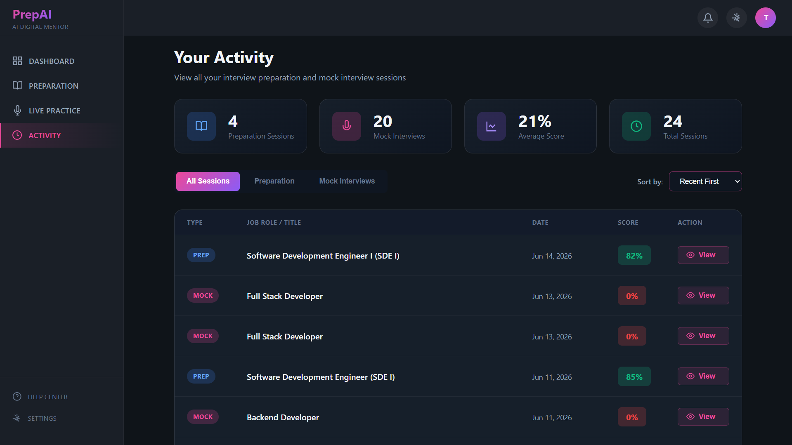

# PrepAI 
### AI-Powered Interview Preparation Platform

PrepAI is a full-stack MERN application that helps job seekers prepare for interviews using AI. It offers two modes: **Resume Preparation** and **AI Mock Interview** with complete voice interaction.

---

## 🌟 Features

### 📄 Resume Preparation Mode
- Upload resume (PDF/DOCX) and paste job description
- AI-powered **ATS Match Score** (0-100)
- **Skill Gap Analysis** with severity levels
- **10 Interview Questions** (Technical, Behavioral, Situational)
- **5-Day Preparation Roadmap**
- Detailed answers and STAR method responses

### 🎙️ AI Mock Interview Mode
- **Voice-based real-time interview** simulation
- AI interviewer speaks questions using **Google Cloud TTS** (Neural2-J voice)
- **Continuous speech recording** with Web Speech API (no pause interruption)
- **8 AI-generated questions** across Technical, Behavioral, and Project categories
- Real-time speech-to-text transcription
- Auto-advance to next question after each answer

### 📊 Performance Evaluation
- **Overall Score** (0-100) with grade (A+, A, B+, B, C, D)
- Score breakdown: **Communication, Technical Knowledge, Confidence**
- Speaking analytics: **WPM**, filler word detection (um, uh, like), word count
- **Question-by-question AI feedback**
- Strengths & Areas for Improvement
- Detailed AI-generated performance summary

### 📋 Activity Dashboard
- View all past sessions (Preparation + Mock)
- Filter by session type
- Sort by date or score
- Quick access to any session report

---

##  Tech Stack

### Frontend
| Technology | Purpose |
|------------|---------|
| React.js | UI Framework |
| React Router | Client-side routing |
| SCSS | Styling |
| Web Speech API | Voice recording & transcription |
| Axios | HTTP requests |

### Backend
| Technology | Purpose |
|------------|---------|
| Node.js | Runtime |
| Express.js | Web framework |
| MongoDB | Database |
| Mongoose | ODM |
| Multer | File uploads |
| pdf-parse | Resume parsing |
| JWT | Authentication |

### AI & Cloud
| Technology | Purpose |
|------------|---------|
| Google Gemini API | AI question generation & evaluation |
| Google Cloud TTS | AI voice (Neural2-J) |

---

## Getting Started

### Prerequisites
- Node.js v18+
- MongoDB (local or Atlas)
- Google Gemini API Key
- Google Cloud TTS API Key

### Installation

**1. Clone the repository**
```bash
git clone https://github.com/yourusername/PrepAI.git
cd PrepAI
```

**2. Setup Backend**
```bash
cd backend
npm install
```

Create `.env` file in backend folder:
```env
PORT=3000
MONGO_URI=your_mongodb_connection_string
JWT_ACCESS_SECRET=your_access_secret
JWT_REFRESH_SECRET=your_refresh_secret
GOOGLE_GENAI_API_KEY=your_gemini_api_key
GOOGLE_CLOUD_TTS_API_KEY=your_tts_api_key
```

Start backend:
```bash
npm run dev
```

**3. Setup Frontend**
```bash
cd frontend
npm install
npm run dev
```

**4. Open in browser**
https://prep-ai-phi-three.vercel.app/

## Project Structure
```bash
PrepAI/
├── backend/
│   └── src/
│       ├── controllers/
│       │   ├── auth.controller.js
│       │   ├── interview.controller.js
│       │   └── mockInterview.controller.js
│       ├── models/
│       │   ├── user.model.js
│       │   ├── interviewReport.model.js
│       │   └── mockInterviewSession.model.js
│       ├── routes/
│       │   ├── auth.routes.js
│       │   ├── interview.routes.js
│       │   └── mockInterview.routes.js
│       └── services/
│           ├── ai.service.js
│           └── tts.service.js
│
└── frontend/
└── src/
├── components/
│   └── layout/
│       ├── Layout.jsx
│       ├── Sidebar.jsx
│       └── TopNavbar.jsx
├── features/
│   ├── auth/
│   ├── dashboard/
│   ├── interview/
│   ├── mockInterview/
│   │   ├── pages/
│   │   │   ├── MockSetup.jsx
│   │   │   ├── LiveInterview.jsx
│   │   │   └── MockResults.jsx
│   │   └── hooks/
│   │       ├── useMockInterview.js
│   │       └── useAudioRecorder.js
│   └── activity/
│       └── Activity.jsx
└── app.router.jsx
```
## 💡 How It Works

### Resume Preparation Flow
1. Upload Resume (PDF/DOCX)
2. Paste Job Description
3. AI Analysis (Gemini API)
4. Get ATS Score + Skill Gaps
5. View Interview Questions
6. Follow 5-Day Roadmap

### Mock Interview Flow
1. Upload Resume + Select Job Role
2. Test Microphone
3. Start Interview
4. AI Speaks Question (Google Cloud TTS)
5. Record Your Answer (Web Speech API)
6. Real-time Transcription
7. Submit → Next Question
8. Complete → Performance Report

## Screenshots

| Dashboard | Mock Setup |
|-----------|------------|
|  |  |

| Live Interview | Results |
|----------------|---------|
|  |  |
